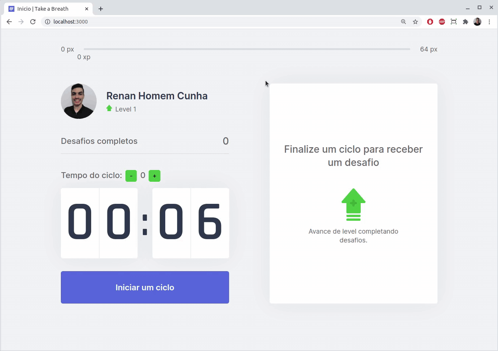

# Projeto Take a Breath

## Descrição
Durante o tempo de utilização de dispositivos de acesso a internet (como computadores, tablets, celulares, entre outros) é comum ficarmos muito tempo sem realizar uma pausa, o que pode prejudicar a nossa saúde e a nossa produtividade.  
Essa aplicação tem por objetivo resolver este problema, aplicando intervalos de tempo para cada sessão de estudo ou trabalho, e sugerindo exercícios para o corpo ou para a visão de forma gamificada, aumentando o level e experiência do usuário conforme ele vai completando os desafios.  

## Tecnologias utilizadas

- HTML
- Javascript
- CSS
- React.JS/Next.JS
- Context API
- React Hooks
- Deploy (Vercel)

## Desenvolvimento
Esse projeto foi desenvolvido durante a trilha de React Next Level Week 4 da [Rocketseat](https://www.rocketseat.com.br). 

No GIF abaixo é possível ver uma demonstração da aplicação funcionando com tempo de ciclo para 6 segundos para uma demonstração mais rápida (o tempo original do ciclo na aplicação é de 25 minutos).

## Teste da aplicação
Foi realizado o deploy da aplicação através do Vercel, segue o [link](https://take-a-breath.vercel.app) para teste.

Para baixar a aplicação em sua máquina segue as intruções(comandos):

1. Clone o repositório:
- _`git clone https://github.com/renanhcunha/take-a-breath.git`_

2. Instale as dependências:
- _`npm install`_

3. Rode a aplicação: 
- _`npm run dev`_